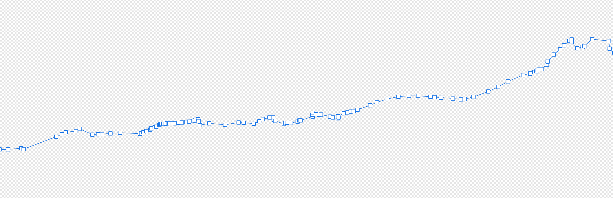
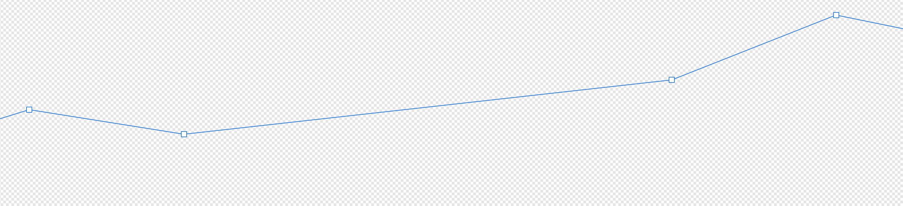

[Get Timezone demo here](https://gettimezone.vercel.app/)  

This repo is about data preparation for the [GetTimezone](https://github.com/jonathanlurie/gettimezone) project.  
The timezone geojson comes from the project [timezone-boundary-builder](https://github.com/evansiroky/timezone-boundary-builder) ([this release](https://github.com/evansiroky/timezone-boundary-builder/releases/tag/2020d)).

# How is the timezone data prepared?
For each timezone, one or more polygons. Those polygons are of a fairly high definition, though a bit too much so I've decided to simplify the lines using a [Douglas-Peucker methods](https://github.com/mourner/simplify-js).  

As an example, this is what &km of France-Switzerland border look like in the original package:
  

And how it looks like when simplified:
  

One of the goal to achieve is to obtain a fairly small package so that it can easily be spawn on a lambda function, wrapped with some backend code for a spatial lookup. If the polygons are too detailed, the serverless option may suffer from a long cold start and if it's too downsample, then we lose spatial lookup precision. I've tried many downsampling tolerance distances and this one was a good middleground, allowing for having the entire world in under 3MB.  

Once simplified, some polygon get so small that there area becomes 0. We don't keep those.

## How to reach under 3MB?
Fist, I have decided not to deal with holes in timezone polygons and I am actually not even sure there are, since timezones to countries is not a 1-to-1 relationship and it would make little sense (though, this may happen, mainly for polytical reasons). The other reason to not deal with holes is that it simplifies greatly the datastructure: one timezone composed of N polygons is just N binary buffers containing little endian `float32` as follow: `lon1 lat1 lon2 lat2 ... lonN latN lon1 lat1`. No header, no metadata, just the bare minimum, we know how many points there is in the buffer as follow: `bufferByteSize / 8` (divide by 4 because a float32 takes 4 bytes and then again by 2 because we need two number for one coordinate). I also found that zipping was not worth because most of these polygons are fairly small but with no number repetition, hence resulting in a poor compression ratio and the overhead of storing compression metadata was just making my buffer larger.  

Once each buffer is prepared, they are saved in a folder being a URI encoded version of the timezone Id, under the name being ther index of polygon withing this timezone.   
For instance, the timezone `Europe/Paris` becomes the folder `Europe%2FParis` (to avoid having `/` in dir name) and the 2 non null polygon it contains become:
```
/Europe%2FParis
  /0.bin
  /1.bin
```

# Bounding boxes and Bounding Volume Hierarchy
In addition to store each polygon as a binary buffer, we also want to prepare a way to quickly look up a lon/lat coordinate. Since doing an iterative hit test over all the polygons would be way too long, I have decided to prepare bounding volume hierarchy ("BVH") index where all the polygons are represented only by their axis-aligned bounding-box ("AABB").  
This method will greatly accelerate the hit test (BVH is part of a family called "accelerating structures") by hitting a top level AABB, and then check the children AABB and so on down to reaching a AABB that is the simplified representation of an actual polygon. At this moment, and  only for the very shold list of AABB candidate for the hit test, the actual binary buffer of candidate polygons are being loaded and a precise polygon "inside test" is performed.  

The BVH is also serialized, but into JSON because it's just easier. If you open the file `timezone_data/output/bvh.json`, you may notice that it's quite compact and with only short property names, again, it is to reduce the file size and make a smaller package.